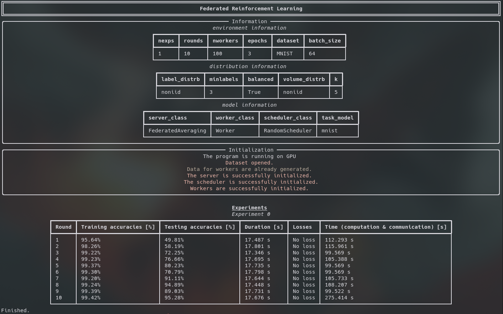

# Federated Reinforcement Learning



## Introduction

The goal of this project is to simulate an environment for **Federated Learning** and experiment different algorithms using **Reinforcement Learning** for better aggregation or to select in a better way the next participants.

## Installation

1. First, download the repository
```
git clone https://github.com/bourbonut/reinforcedFL.git 
```

2. Then **create your own environment** with a version of `python >= 3.8.5`.
For instance, with `conda` :
```shell
conda create -n reinforcedFL python=3.8.5
conda activate reinforcedFL
```

3. Install `pytorch`
For example, with `conda` :
```
conda install pytorch torchvision torchaudio cudatoolkit=11.6 -c pytorch -c conda-forge
```

4. Then install other packages :
```shell
pip install -r requirements.txt
```

## Usage

### Configuration tree
Three configurations files must be created to run a simulation. It is recommended to create the following tree:
```
.
├── ascii_sequential_execution.py
├── ...
└── configurations
    ├── environment
    │   ├── env20.json
    │   ├── ...
    │   └── env100.json
    ├── distribution
    │   ├── iid.json
    │   ├── ...
    │   └── noniid.json
    └── model
        ├── fedavg.json
        ├── ...
        └── evaluator.json
```

### Example of configuration files

Comments with `#` must be deleted.

- In an `environment` file :
```json
{
    "nexps": 20,	# number of experiments
    "rounds": 10,	# number of rounds
    "epochs": 3,	# number of epochs
    "nworkers": 20,	# number of workers
    "dataset": "MNIST"	# name of the dataset
}
```

- In an `distribution` file :
```json
{
    "label_distrb":"noniid",	# labels are non independent and identically distributed
    "minlabels":3,		# there are at least 3 labels per worker
    "volume_distrb":"noniid",	# volume of data is non independent and identically distributed
    "balanced":true,		# True for "per worker" else each worker is a cluster of labels
    "k":5			# coefficient for data augmentation (example MNIST : 60_000 x 5 = 300_000 samples)
}
```

- In an `model` file :
```json
{
  "worker_class": "Worker",		    # name of the worker class
  "server_class": "FederatedAveraging",	    # name of the algorithm for aggregation
  "scheduler_class": "RandomScheduler",	    # name of the scheduler class
  "task_model": "mnist",		    # name of the task model for workers
  "batch_size": 64			    # batch size
}
```


### Run a simulation

Run the following command :
```shell
python ascii_sequential_execution.py <path_env_conf> <path_distrb_file> <path_model_file>
```
Add the flag `--cpu` to run on CPU and the flag `--refresh` to refresh the distribution of data if you need.
By default, the program will choose the GPU if there is one, else it will run on CPU.

For instance :
```shell
python ascii_sequential_execution.py ./configurations/environment/env20.json ./configurations/distribution/iid.json ./configurations/model/fedavg.json --cpu --refresh
```

### Results

For each experiment, data are distributed and saved in `./experiments` as results. 
If the data was already generated, it can be generated again with the flag `--refresh` else, the program will skip the generation of data.
The index of the name of the directory `./experiments/experiment-{k}` increases by increments between each experiment.
Almost all results are saved as `.pkl` file (see [pickle](https://docs.python.org/3/library/pickle.html)) and can be opened easily :
```python
import pickle
with open("data.pkl", "rb") as file:
    data = pickle.load(file)

print(data)
```
